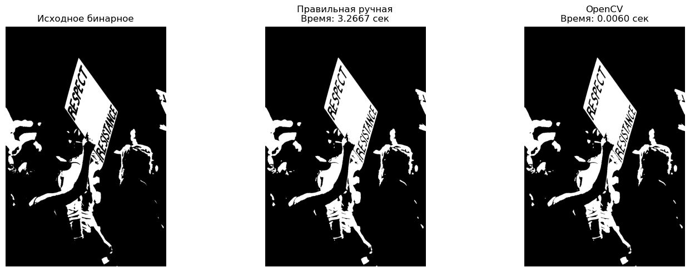

# Лабораторная работа: Реализация фильтра Дилатации

## 1. Теоретическая база

**Дилатация (Dilation)** — это одна из двух основных операций математической морфологии (наряду с эрозией). Она применяется к бинарным изображениям. 

Дилатация расширяет структуру исходного изображения. Этот способ проходит по всем точкам изображения и придает пикселю значение логической суммы всех остальных пикселей попавших в область вокруг него. Эта область называется ядро и оно может быть разным, но в данном случае используется ядро 3x3.

Математическая формула
    `dst(x, y) = max(src(x + i, y + j))`, где `(i, j)` перебирает координаты ядра.

Белые области увеличиваются, небольшие отверстия внутри объектов могут зарастать, отдельные объекты, расположенные близко, могут слипаться.

## 2. Описание разработанной системы

В рамках работы были реализованы два варианта программы для применения фильтра дилатации (с ядром 3x3) к изображению:

1.  **Ручная реализация (Python):**
    *   Изображение загружается с помощью библиотеки OpenCV. **Исключительно загружается!!**
    *   Алгоритм проходит по каждому пикселю. Для крайних пикселей ядро обрезается.
    *   Для каждого центрального пикселя просматриваются его соседи в окне 3x3.
    *   Находится максимальное значение среди этих соседей.
    *   Результат записывается в выходное изображение.

2.  **Библиотечная реализация (OpenCV):**
    *   Создается структурный элемент 3x3 с помощью `cv2.getStructuringElement(cv2.MORPH_RECT, (3,3))`.
    *   На его основании используется встроенная высокооптимизированная функция `cv2.dilate()`.

Программа написана с помощью jupiter notebook.

## 3. Результаты работы и тестирования системы

### Входные данные
*   Тестовое изображение: `input.png` (например, черно-белый текст или геометрические фигуры).
*   Размер изображения - 1280x853 пикселей.

### Визуальные результаты

Сравнение визульных результатов, картинка вывод python кода

### Сравнение быстродействия

Замеры времени производились с помощью модуля `time`. Усредненные результаты для изображения 1280x853:

| Реализация | Время выполнения (сек) |
| :--------- | :--------------------- |
| Ручная (Python) | 3.390085 |
| OpenCV (C++ backend) | 0.001062 | 

Библиотечная реализация более оптимизирована и естественно значительно быстрее примерно 3191.7, плюс она написана нативно на C++, который сам по себе быстрее.

## 4. Заключение

В ходе работы был реаллизован алгоритм дилатации 2 способами, вручную и через библиотеку OpenCV. Обе реализации дают идентичный результат. Ручная реализация оказалась щначительно меленнее. 

Это связано с тем, что Python является интерпретируемым языком, и циклы по каждому пикселю выполняются медленно, в то время как OpenCV написан на C/C++ и использует низкоуровневые оптимизации.
